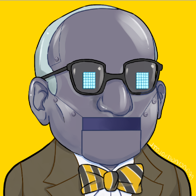

<p align="center">
</p>

## Description

Client Twitter repository to be used as base for new APIs in our project.

## Installation

```bash
$ npm install
```

## Running the app

```bash
# development
$ npm run start

# watch mode
$ npm run start:dev

# production mode
$ npm run start:prod
```

## Test

```bash
# unit tests
$ npm run test

# e2e tests
$ npm run test:e2e

# test coverage
$ npm run test:cov
```

## Extras

```bash
# remove all deps and reinstall from scratch
$ npm run clean

# check for dependencies updates
$ npm run check
```

## License

This project is released under the terms of the MIT license.
See https://opensource.org/licenses/MIT.
